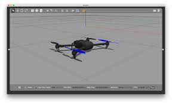
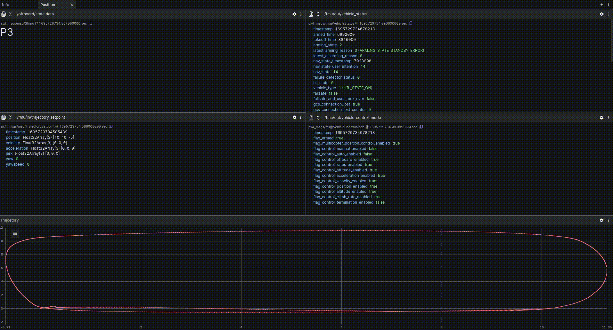

# General Information 🌍

This repository contains an example of a ROS 2 node which communicate with a drone using PX4 and ROS 2.
Communication via uXRCE-DDS (PX4 version `1.14.0`).

The repository contains launch file which launch:
1. Gazebo simulation (headless / gui options available).
2. A PX4 instans which control the simulated drone.
3. DDS agent for ROS 2 - PX4 communication.
4. An Offboard node which sends setpoints for the control system.

# Installation 🛫

Clone the repository from Github:

                https://github.com/citros-garden/drone.git

Then open the repository in VSCode's `devcontainer` with `reopen in container option`.
The [Dockerfile](.devcontainer/Dockerfile) contains all the necessary dependencies for the project, and the 
[install](.devcontainer/install.sh) script will clone PX4-Autopilot and build the firmware, along with building ROS 2 workspace.

# Pre-defined VSCode Tasks 📝

This repository contains pre-defined [VSCode tasks](.vscode/tasks.json) which are helpful for building and running the example.
They can be run by typing `ctrl+p`. In the drop-down menu type `task ` (space after task) and you should see them appear.

The following tasks are available:

1. `build` - building the ROS 2 workspace
2. `launch` - launch the simulation in `headless` mode.
3. `launch-gui` - launch the simulation in `GUI` mode.

**Note**: The `launch` and `launch-gui` commands are depend on the `build`, so when you launch with task, a build task will run before launch.

## Manually Build 🚜
Build and source the ROS 2 workspace with:

        cd ros2_ws
        colcon build
        source install/local_setup.bash

## Manually Run 🚀
Run a headless simulation:

                ros2 launch px4_offboard offboard_position_control.launch.py headless:=True

Run a GUI simulation:

                ros2 launch px4_offboard offboard_position_control.launch.py headless:=False

# Develop :bulb:
Currently, the [px4_offboard](ros2_ws/src/px4_offboard/) package contains a node which sends rectangular waypoints to the drone. The 4 waypoints are located in the package's [parameters](ros2_ws/src/px4_offboard/config/params.yaml).

# Foxglove Visualization :eyes:
